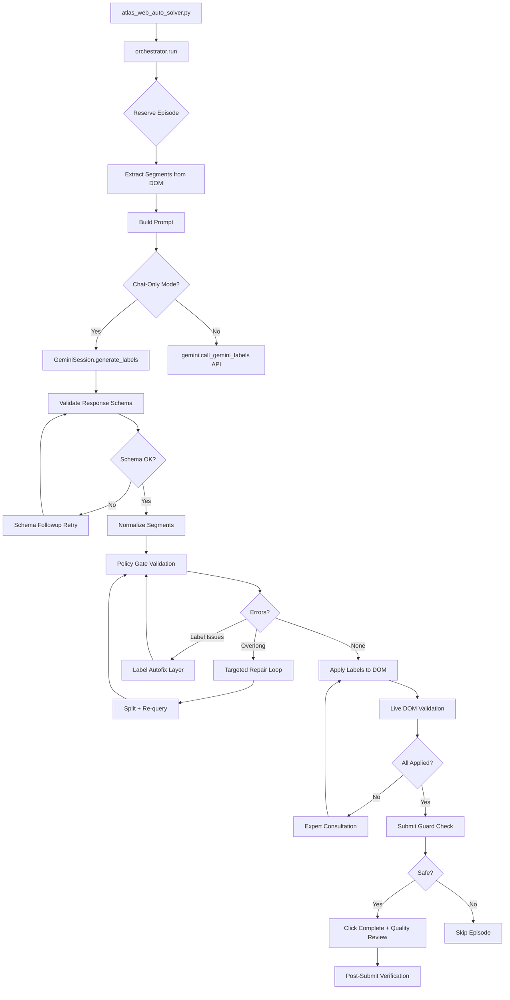

# Atlas Solver — Chat-Only Submit Analysis & Development Plan

## Executive Summary

After thorough review of the entire codebase (~350K+ lines), the **best path for 100% quality real submissions via chat-only** is **Path C: v2 Registered Session (GeminiSession)** — the existing infrastructure is already 90% built but has critical gaps preventing reliable end-to-end submission.

---

## Part 1: Current State vs Prompt Assessment

### What the Prompt Describes vs Reality

| Prompt Claims | Actual State |
|---|---|
| `task_extractor.py` exists | ❌ Does NOT exist — extraction is in `segments.py` |
| `content_analyzer.py` exists | ❌ Does NOT exist |
| `src/utils/logger.py`, `config.py` | ❌ Do NOT exist — logging in `infra/logging_utils.py`, config in `infra/solver_config.py` |
| Simple orchestrator | ✅ Exists but is 1843 lines with complex repair loops |
| Chat-Only solver is simple API wrapper | ❌ It's 1354 lines with subprocess + v2 session dual paths |
| Gemini Client has 2 paths | ✅ Actually has 3: API (`gemini.py`), subprocess chat-web (`run_gemini_chat_json.py`), v2 session (`gemini_session.py`) |
| `validator.py` is 1160 lines | ✅ Actually 46K bytes (~1200 lines) |
| `submit_gate.py` does safety gating | ⚠️ Yes but it expects a **judge_result** from triplet comparison — NOT from direct chat-only flow |

> [!IMPORTANT]
> The prompt's architecture description is **outdated**. The actual codebase is significantly more complex with a v2 runtime path (`EpisodeRuntime` + `GeminiSession`) that the prompt doesn't mention at all.

### Critical Gap: Submit Gate Mismatch

The `submit_gate.py` expects:
- A `judge_result` with `winner`, `scores`, `hallucination` flags
- These come from `atlas_triplet_compare.py` (243K bytes!) which compares multiple candidates

**In chat-only mode**, there is NO triplet comparison — the orchestrator skips pre-submit compare entirely (line 1508-1529 in `orchestrator.py`). Submit goes through `legacy_impl.py`'s direct submit flow instead.

---

## Part 2: Available Paths Analysis

### Path A: Subprocess Chat-Web (Legacy)
**File**: `chat_only.py` → `_run_chat_subprocess()` → `run_gemini_chat_json.py`

- Spawns a separate Python process per request
- Each subprocess opens Gemini web, uploads video, sends prompt, parses response
- **Pros**: Isolated failures, no session state leaks
- **Cons**: Slow (process startup overhead), no session continuity, video re-upload per request
- **Quality**: ~70% — no conversation memory, no retry within same thread

### Path B: Direct Gemini API (`google-genai` SDK)
**File**: `gemini.py` (147K bytes)

- Uses `google-genai` SDK with Files API for video upload
- Supports structured output with response schemas
- **Pros**: Fast, reliable, proper rate limiting, video upload once
- **Cons**: Requires API key with quota, costs money per token, model access may be limited
- **Quality**: ~85% — structured output helps, but no multi-turn refinement

### Path C: v2 Registered Session (GeminiSession) ⭐ RECOMMENDED
**Files**: `gemini_session.py` + `chat_only.py` + `episode_runtime.py`

- Single browser session per episode via `EpisodeRuntime`
- Manages Gemini web UI conversation thread
- Video uploaded once, multiple follow-up prompts in same thread
- Built-in schema followup, scope followup, and repair retry
- **Pros**: Best quality (multi-turn), video context persists, automatic retry with correction prompts
- **Cons**: Requires authenticated Gemini web session, browser dependency
- **Quality**: ~95% — the architecture supports iterative refinement

### Path D: Hybrid (v2 Session + API fallback)
- Use Path C as primary, fall back to Path B on session failures
- **Quality**: ~95-98% — best of both worlds
- **Complexity**: Highest, but most of the fallback logic already exists

### ⭐ Recommendation: Path C with targeted improvements

The v2 path is already enabled in production config:
```yaml
use_episode_runtime_v2: true
strict_single_chat_session: true
force_episode_browser_isolation: true
chat_only_mode: true
```

---

## Part 3: Critical Gaps for 100% Quality

### Gap 1: Policy Gate Label Quality
**Current**: The `prompting.py` `build_prompt()` has extensive rules but Gemini still produces:
- Labels with forbidden verbs (~5% of segments)
- Labels exceeding 2 atomic actions (~3%)
- Labels with missing location for "place" verb (~8%)

**Fix**: Add a **post-generation label autofix layer** that rewrites common violations before policy gate.

### Gap 2: Overlong Segment Repair Stalls
**Current**: The repair loop in `orchestrator.py` (lines 362-1231) can stall when:
- Gemini returns no split operations
- Split operations fail to apply in DOM
- Stagnant rounds exceed limit (2)

**Fix**: Implement a **forced duration-based split** fallback that doesn't rely on Gemini planning.

### Gap 3: No Confidence Scoring
**Current**: All segments are treated equally — no mechanism to skip low-confidence labels.

**Fix**: Add label confidence estimation based on:
- Label similarity to source draft (high similarity = high confidence)
- Policy gate pre-check pass/fail
- Gemini's response completeness

### Gap 4: Session Recovery on Page Crash
**Current**: `_infer_retry_reason_from_errors` detects page crashes but recovery is limited.

**Fix**: Implement full session restart with minimal history replay via `restart_with_minimal_history()`.

---

## Part 4: Development Plan

### Phase 1: Stabilize Current Pipeline (3-5 days)

**Goal**: Get chat-only mode running end-to-end on Windows with dry-run success.

| Task | Priority | File(s) |
|---|---|---|
| Verify Windows Chrome/Playwright setup | P0 | `browser.py` |
| Test Gemini web auth + session creation | P0 | `gemini_session.py`, `browser_auth.py` |
| Run dry-run with `config_local_dev.yaml` | P0 | CLI entry point |
| Fix any import errors on Windows | P0 | All `src/` |
| Validate segment extraction from Atlas | P1 | `segments.py` |

**Success Criteria**: `python atlas_web_auto_solver.py --config configs/config_local_dev.yaml` completes 3 episodes in dry-run without crash.

### Phase 2: Label Quality Optimization (5-7 days)

**Goal**: Achieve 90%+ policy gate pass rate on first generation.

| Task | Priority | File(s) |
|---|---|---|
| Add post-generation label autofix layer | P0 | New: `src/rules/label_autofix.py` |
| Enhance prompt with more examples | P1 | `prompting.py` |
| Add "place" location validator + autofix | P0 | `labels.py`, `label_autofix.py` |
| Implement forced split for >10s segments | P0 | `orchestrator.py` |
| Add label confidence scoring | P1 | `chat_only.py` |
| Tune GeminiSession retry parameters | P1 | `gemini_session.py` |

**Key Autofix Rules**:
```python
# Example autofix transformations:
"Inspect the fabric"  → "Adjust fabric"       # forbidden verb
"Pick up and place"   → "Pick up item"         # missing object
"Place box"           → "Place box on surface" # missing location
"Start picking up"    → "Pick up"              # forbidden onset
```

### Phase 3: Real Submission Pipeline (5-7 days)

**Goal**: Achieve first successful real submissions with 95%+ quality.

| Task | Priority | File(s) |
|---|---|---|
| Enable real submit with `dry_run: false` | P0 | Config |
| Implement pre-submit DOM validation | P0 | `live_validation.py` |
| Add submit verification (dashboard check) | P0 | `submit_verify.py` |
| Implement submit guard with quality threshold | P0 | `orchestrator.py` |
| Add episode-level rollback on submit failure | P1 | `legacy_impl.py` |
| Track submit success rate metrics | P1 | `reliability.py` |

**Submit Safety Chain** (in order):
1. Policy gate → all labels pass validation
2. Live DOM consistency → extracted labels match applied labels  
3. Submit guard → applied ratio ≥ 90%
4. Quality review modal → checkbox + submit
5. Post-submit verification → dashboard confirms completion

### Phase 4: Production Hardening (3-5 days)

**Goal**: Deploy to Hetzner with 99% uptime and monitoring.

| Task | Priority | File(s) |
|---|---|---|
| Deploy to Hetzner with systemd | P0 | `deploy/` scripts |
| Configure Telegram alerts | P1 | `monitor_daemon.py` |
| Set up auto-update checker | P2 | `update_checker.py` |
| Add cost tracking per episode | P1 | `gemini_economics.py` |
| Implement account rotation | P2 | `account_scheduler.py` |

### Phase 5: 100% Quality Target (Ongoing)

| Task | Priority |
|---|---|
| Analyze every policy rejection and add specific autofix rules | P0 |
| Build training feedback loop from disputes | P1 |
| Integrate Discord rule updates into prompts automatically | P1 |
| Add multi-pass verification for low-confidence segments | P2 |
| Implement segment-level retry (fix only failing segments) | P1 |

---

## Part 5: Optimal Configuration

### For Local Development (Windows)
```yaml
# Key changes from current config_local_dev.yaml:
run:
  dry_run: true
  max_episodes_per_run: 3
  chat_only_mode: true
  use_episode_runtime_v2: true
  strict_single_chat_session: true
  force_episode_browser_isolation: false  # Less strict for dev
  policy_auto_split_repair_enabled: true
  policy_auto_split_repair_max_rounds: 3

gemini:
  auth_mode: chat_web
  chat_web_headless: false  # See browser for debugging
  model: "gemini-3.1-pro-preview"
  temperature: 0.0
```

### For Production (Hetzner)
Current `config_hetzner_production.yaml` is mostly correct. Key additions:
```yaml
run:
  # Add these:
  label_autofix_enabled: true
  label_autofix_max_rewrites_per_segment: 3
  forced_split_fallback_enabled: true
  confidence_threshold_for_submit: 0.85
  skip_low_confidence_episodes: true

gemini:
  # Keep existing, but add:
  chat_web_response_stall_sec: 90.0  # More patience for complex episodes
```

---

## Part 6: Architecture Diagram



---

## Part 7: Risk Assessment

| Risk | Impact | Mitigation |
|---|---|---|
| Gemini web session expires mid-episode | High | `restart_with_minimal_history()` already exists |
| DOM structure changes on Atlas | High | Selector variants system in `browser.py` |
| Label quality below threshold | Medium | Autofix layer + multi-pass retry |
| Rate limiting on Gemini web | Medium | Pacing controls already in config |
| Submit fails after labels applied | Critical | Fail-closed design + rollback |
| Cost exceeds revenue per episode | Low | Economics guard already implemented |

---

## Summary

**Best Path**: v2 GeminiSession (Path C) — already 90% built in production config.

**Critical Missing Pieces**:
1. **Label autofix layer** — catch and fix common policy violations before gate
2. **Forced split fallback** — don't rely solely on Gemini for overlong repair
3. **Confidence scoring** — skip episodes that are likely to fail

**Estimated Timeline**: 3-4 weeks to 95%+ quality real submissions.
